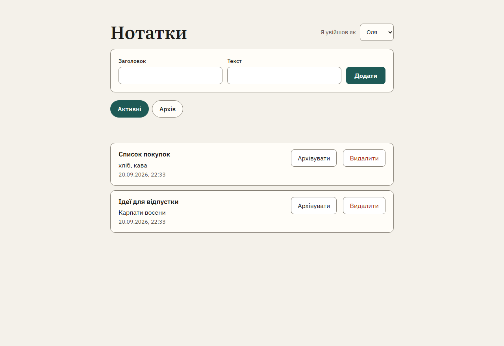
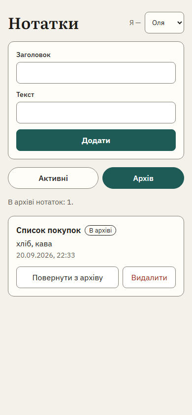

# Task E (bonus) — Шлях 1: Claude Design

**Інструмент:** Claude Design (Design-полотно в claude.ai), без дизайн-системи.

**Полотно:** https://claude.ai/artifact/SZRnyKAqd4c5e9uJAaedVD

**Що просив:** екран нотаток українською — перемикач «Оля / Тарас», форма
«Заголовок + Текст + Додати», фільтр «Активні / Архів», список з кнопками
«Архівувати / Повернути з архіву» і «Видалити», бейдж «В архіві», порожні стани,
помилка на порожній заголовок. Десктоп і телефон, WCAG 2.2 AA, без фреймворку і
без збірки.

**Що вийшло:** клікабельний прототип для десктопа (1280×880) і статичний кадр
телефону (390×844). Доступність на кадрі добра: рідні `<button>` і `<label>`,
`aria-pressed` на фільтрах, `role="status"`, помилка прив'язана до поля через
`aria-describedby`, контраст тексту від 6.5:1.

 

## Відстань до репо

| | Полотно | Репо |
|---|---|---|
| Рядки UI | 256 | 356 |
| Рантайм у браузері | ≈ 321 KB (рантайм полотна + React 18 з CDN) | 0 |
| Переходить без переписування | лише значення: 8 кольорів, 2 шрифти, тексти | — |

## Що довелося б змінити

| Аспект | Згенероване | Що треба тут |
|---|---|---|
| Стек / збірка | `.dc.html`: шаблон `{{…}}`, `<sc-for>`, клас на React 18 | Переписати на DOM API в `public/app.js` — без фреймворку і збірки (`AGENTS.md`) |
| Стилі | inline-стилі, власні hex-кольори, лише світла тема, Google Fonts | `style.css`, `system-ui`, системні `Canvas` / `CanvasText` — темна тема працює сама |
| Адаптивність | фіксована ширина 1280 і 390 px | reflow до 320 px |
| Доступність | добре на кадрі | фокус після зникнення рядка не повертається (запис №2 в `ai-mistakes.md`) |
| Дані | нотатки обох користувачів в одному масиві в пам'яті | `fetch` до `/api/notes` з `x-user-id`, перевірка `res.ok`, сервер — джерело правди |
| Валідація | лише в браузері | правило на сервері, UI показує відмову 400 |
| Авторизація | перемикач користувача — фільтр у браузері; нотатка Тараса лежить на сторінці Олі | власник у `WHERE` кожного запиту; чужий рядок до клієнта не доходить |

**Що варто взяти з полотна:** прив'язку помилки до поля через
`aria-describedby`. У репо пояснення є лише в `#status`.

## Висновок

Claude Design добре показує й узгоджує екран: прототип, стани, палітра. Кодом
для цього репо він не є — жоден рядок не переходить без переписування. Усе, що
нижче компонента, — дані, валідація, авторизація, фокус — треба писати в репо і
перевіряти тестами. Переносити прототип як є небезпечно: фільтр за користувачем
у браузері — це витік чужих даних.
